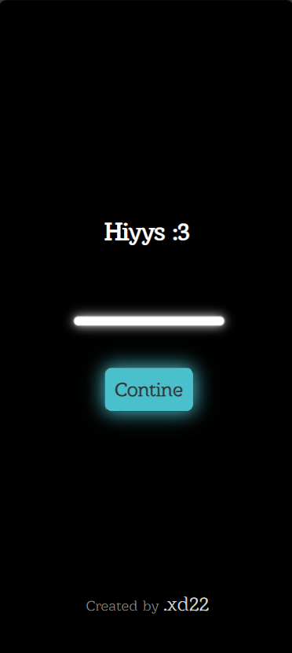

# Happy New Year 2024 :)
this was hosted on pythonanywhere[.]com  
that's why it's using flask framework  
- to run use `python3 main.py`
- mongo db was used as a logger to see how much traffic we can get
- telegram bot is used for logging instead
- alot of mind blowing animations
- pretty nice footer for criedts
- Customizing names using the edit page on `/edit`
- Or share url like this : `127.0.0.1:5000/ben`
- thanks to flask we can catch names from the url and compile new pages
- you can share with friends  
- enjoy

